# @ureq - Universal HTTP Request Library

[](https://badge.fury.io/js/@ureq%2Fcore)
[](https://opensource.org/licenses/MIT)
[](https://www.typescriptlang.org/)

> 名字由来：Universal Request的简写，发音类似"you-request"

A modern, modular, and extensible HTTP request library for JavaScript/TypeScript applications. Built with a clean architecture that supports multiple HTTP implementations and advanced features like caching, retries, interceptors, and more.

## 🏗️ Architecture Overview

```mermaid
graph TB
    %% User Entry Points
    User[👤 User Application]

    %% Core Packages
    Core["@ureq/core<br/>🎯 Main Request Engine<br/>• Request class<br/>• Interceptors<br/>• Error handling<br/>• Feature composition"]

    %% Implementation Packages
    ImplFetch["@ureq/impl-fetch<br/>🌐 Fetch Implementation<br/>• Native fetch API<br/>• Browser & Node.js<br/>• Lightweight"]

    ImplAxios["@ureq/impl-axios<br/>📡 Axios Implementation<br/>• Axios adapter<br/>• Rich features<br/>• Legacy support"]

    %% Business Layer
    Business["@ureq/business<br/>🏢 Business Abstractions<br/>• HashService interface<br/>• CacheStore interface<br/>• Default implementations"]

    %% Utility Libraries
    LibHash["@ureq/lib-hash<br/>🔐 Hash Utilities<br/>• Request hashing<br/>• String hashing<br/>• Deduplication"]

    LibCache["@ureq/lib-cache-store<br/>💾 Cache Storage<br/>• Memory store<br/>• TTL support<br/>• Storage interface"]

    %% Development & Demo
    Playground["@ureq/playground<br/>🎮 Demo & Testing<br/>• Usage examples<br/>• Feature demos<br/>• Development testing"]

    Docs["@ureq/docs<br/>📚 Documentation<br/>• VitePress docs<br/>• API reference<br/>• Usage guides"]

    %% Dependencies
    User --> Core
    User --> ImplFetch
    User --> ImplAxios

    Core --> Business
    ImplFetch --> Core
    ImplAxios --> Core

    Business --> LibHash
    Business --> LibCache

    Playground --> Core
    Playground --> ImplFetch
    Playground --> ImplAxios
    Playground --> Business

    Docs --> Core
    Docs --> ImplFetch
    Docs --> ImplAxios

    %% External Dependencies
    ImplAxios -.-> Axios[axios npm package]

    %% Styling
    classDef userEntry fill:#e1f5fe,stroke:#01579b,stroke-width:2px
    classDef core fill:#f3e5f5,stroke:#4a148c,stroke-width:3px
    classDef impl fill:#e8f5e8,stroke:#1b5e20,stroke-width:2px
    classDef business fill:#fff3e0,stroke:#e65100,stroke-width:2px
    classDef lib fill:#fce4ec,stroke:#880e4f,stroke-width:2px
    classDef dev fill:#f1f8e9,stroke:#33691e,stroke-width:2px
    classDef external fill:#f5f5f5,stroke:#616161,stroke-width:1px,stroke-dasharray: 5 5

    class User userEntry
    class Core core
    class ImplFetch,ImplAxios impl
    class Business business
    class LibHash,LibCache lib
    class Playground,Docs dev
    class Axios external
```



## 🚀 Quick Start

### Installation

Choose your preferred HTTP implementation:

```bash
# Option 1: Using Fetch (Recommended for modern environments)
npm install @ureq/core @ureq/impl-fetch

# Option 2: Using Axios (For legacy support or advanced features)
npm install @ureq/core @ureq/impl-axios

# Option 3: Install both for flexibility
npm install @ureq/core @ureq/impl-fetch @ureq/impl-axios
```

### Basic Usage

```typescript
import { Request } from '@ureq/core';
import { FetchRequestor } from '@ureq/impl-fetch';

// Create a request instance
const request = new Request(new FetchRequestor({
  baseURL: 'https://api.example.com'
}));

// Make requests
const user = await request.get('/users/1');
const newUser = await request.post('/users', {
  name: 'John Doe',
  email: 'john@example.com'
});
```

## 📦 Package Overview

### Core Packages (Required)

- **`@ureq/core`** - Main request engine with interceptors, error handling, and feature composition
- **`@ureq/impl-fetch`** OR **`@ureq/impl-axios`** - Choose your HTTP implementation

### Implementation Packages (Choose One)

- **`@ureq/impl-fetch`** - Lightweight, uses native Fetch API (recommended)
- **`@ureq/impl-axios`** - Feature-rich, uses Axios library

### Optional Packages

- **`@ureq/business`** - Business layer abstractions (auto-installed with core)

## ✨ Features

- 🎯 **Multiple HTTP Implementations** - Choose between Fetch or Axios
- 🔄 **Smart Retry Logic** - Configurable retry strategies with exponential backoff
- 💾 **Built-in Caching** - Memory cache with TTL support
- 🚦 **Request Interceptors** - Transform requests and responses
- ⚡ **Parallel Requests** - Concurrent request management
- 🔒 **Request Deduplication** - Prevent duplicate requests
- ⏱️ **Timeout Control** - Request timeout management
- 🛡️ **Error Handling** - Comprehensive error types and handling
- 📝 **TypeScript Support** - Full type safety and IntelliSense
- 🎮 **Modular Design** - Use only what you need

## 🛠️ Development

This project uses [Turbo](https://turbo.build/) for fast, parallel builds and [pnpm](https://pnpm.io/) for package management.

### Prerequisites

```bash
npm install -g pnpm
```

### Setup

```bash
# Install dependencies
pnpm install

# Build all packages
pnpm build

# Run development mode
pnpm dev
```

### Available Scripts

```bash
# Build all packages in parallel
pnpm build

# Run tests
pnpm test

# Lint code
pnpm lint

# Format code
pnpm format

# Run playground demos
pnpm demo:all
pnpm demo:basic
pnpm demo:features
pnpm demo:interceptors
pnpm demo:error-handling

# Start documentation
pnpm docs:dev
```

## 📚 Documentation

Visit our [documentation site](./docs) for detailed guides, API reference, and examples.

## 🎮 Examples

Check out the [playground](./packages/playground) for comprehensive examples of all features.

## 🤝 Contributing

We welcome contributions! Please see our [Contributing Guide](./CONTRIBUTING.md) for details.

## 📄 License

MIT © [Your Name](./LICENSE)

